# ThreadPipeline 文档

ThreadPipeline 是 AcaBot runtime 中单次 run 的最小执行器。它拿到一个已经路由完成的 `RunContext`，按固定阶段依次完成消息写入、上下文压缩、记忆检索与注入、agent 调用、动作分发和 run 收尾。

## 1. 组件概览

### 职责

- 接收一个完整的 `RunContext`，驱动从"用户消息到达"到"回复送达 + run 收尾"的完整生命周期
- 协调 compaction、retrieval、memory injection、agent execution、outbox dispatch 等子系统
- 管理 run 状态机转换（running → completed / failed / waiting_approval）
- 在 pipeline 异常时做安全收尾，不让异常泄漏到上层

### 边界

| 管什么 | 不管什么 |
|--------|---------|
| 单次 run 的执行编排 | 路由决策（由 RuntimeRouter / SessionRuntime 完成） |
| 消息写入 thread working memory | thread 的创建和查找（由 RuntimeApp 完成） |
| 调用 agent runtime 拿结果 | agent 内部的 tool loop 和 model 请求（由 AgentRuntime 完成） |
| 通过 outbox 分发动作 | 动作的实际协议发送（由 Gateway 完成） |
| run 状态收尾 | 全局生命周期和 graceful shutdown（由 RuntimeApp 完成） |

### 系统上下文

ThreadPipeline 处于 runtime 主线的中段位置。上游是 `RuntimeApp.handle_event()` 完成路由后构造的 `RunContext`，下游是 `Outbox` 和 `Gateway`。

```
Gateway → RuntimeApp → SessionRuntime → RuntimeRouter → [RunContext 构造完成]
                                                              ↓
                                                      ThreadPipeline.execute()
                                                              ↓
                                                      Outbox → Gateway
```

## 2. 架构

### 设计模式

- **编排器模式（Orchestrator）**：ThreadPipeline 本身不包含业务逻辑，只按固定顺序调用注入的子系统
- **依赖注入**：所有协作者通过构造函数注入，大部分为可选依赖（`| None`）
- **共享上下文传递**：整条 pipeline 共享一个 `RunContext` 实例，各阶段通过读写 ctx 上的字段通信
- **安全收尾**：顶层 try/except 保证 run 不会停留在 running 状态

### 依赖关系

| 依赖 | 必需 | 用途 |
|------|------|------|
| `AgentRuntime` | 是 | 执行 agent，拿到回复和动作 |
| `Outbox` | 是 | 把动作分发到外部平台 |
| `RunManager` | 是 | 管理 run 状态（running / completed / failed / waiting_approval） |
| `ThreadManager` | 是 | 持久化 thread 状态 |
| `MemoryBroker` | 否 | 检索长期记忆 |
| `RetrievalPlanner` | 否 | 生成 retrieval plan，决定 prompt 怎么组装 |
| `ContextCompactor` | 否 | working memory 压缩 |
| `ComputerRuntime` | 否 | workspace 准备和附件 staging |
| `MessagePreparationService` | 否 | 消息预处理（补齐 history、生成 model 输入） |
| `ToolBroker` | 否 | approval prompt 的 audit 回写 |
| `RuntimePluginManager` | 否 | runtime hook 扩展点 |
| `SoulSource` | 否 | soul 文件真源 |
| `StickyNoteFileStore` | 否 | sticky note 文件真源 |

### 结构与数据流图

```mermaid
graph TD
    subgraph ThreadPipeline.execute
        A[标记 run running] --> B[plugin: ON_EVENT]
        B --> C{ComputerRuntime?}
        C -->|有| D[prepare_run_context]
        C -->|无| E[MessagePreparation]
        D --> E
        E --> F["锁内: 写入用户消息"]
        F --> G{run_mode?}
        G -->|record_only| H[保存 thread + 标记 completed]
        G -->|正常| I["锁外: Context Compaction"]
        I --> J["锁内: 准备 Retrieval Plan"]
        J --> K[MemoryBroker 注入记忆]
        K --> L[plugin: PRE_AGENT]
        L --> M{skip_agent?}
        M -->|是| N[构造空结果]
        M -->|否| O["AgentRuntime.execute()"]
        N --> P[plugin: POST_AGENT]
        O --> P
        P --> Q{deliver_actions?}
        Q -->|是| R["Outbox.dispatch()"]
        Q -->|否| S[构造内部 delivery report]
        R --> T[更新 thread working memory]
        S --> T
        T --> U[收尾 run 状态]
    end

    style A fill:#e8f4f8
    style U fill:#e8f4f8
    style O fill:#fff3cd
    style R fill:#fff3cd
```



## 3. 接口文档

### 公开方法

| 方法 | 用途 | 参数 | 返回值 | 说明 |
|------|------|------|--------|------|
| `execute(ctx, *, deliver_actions=True)` | 执行完整 pipeline | `ctx: RunContext`, `deliver_actions: bool` | `None` | 主入口，异步 |
| `build_text_reply_action(ctx, text)` | 构造纯文本回复动作 | `ctx: RunContext`, `text: str` | `PlannedAction` | 工具方法，供外部构造最小回复 |

### execute 的行为契约

1. 调用前：`RunContext` 必须已经包含有效的 `run`、`event`、`decision`、`thread`、`agent`
2. 调用后：`ctx.run` 状态一定会被推进到 `completed` / `failed` / `waiting_approval` 之一，不会停留在 `running`
3. 异常安全：即使 pipeline 内部崩溃，也会尽力保存 thread 并标记 run 为 failed

### RunContext 上的读写字段

pipeline 执行过程中会读写 `RunContext` 上的以下关键字段：

| 字段 | 读/写 | 阶段 | 说明 |
|------|-------|------|------|
| `ctx.thread.working_messages` | 读写 | 消息写入 + 收尾 | 写入用户消息、写入 assistant 回复 |
| `ctx.thread.working_summary` | 读 | compaction fallback | 无 compactor 时作为 summary 来源 |
| `ctx.metadata["effective_*"]` | 写 | compaction | 存放压缩结果供后续阶段使用 |
| `ctx.retrieval_plan` | 写 | retrieval planning | 由 planner 或 fallback 填充 |
| `ctx.memory_blocks` | 写 | memory injection | 填入检索到的记忆块 |
| `ctx.messages` | 读 | agent 执行 | agent runtime 读取组装好的对话历史 |
| `ctx.response` | 写 | agent 执行 | 存放 AgentRuntimeResult |
| `ctx.actions` | 写 | agent 执行 | 从 response 提取的动作列表 |
| `ctx.delivery_report` | 写 | dispatch | 存放 outbox 分发结果 |

## 4. 实现细节

### 执行阶段（按顺序）

| # | 阶段 | 做什么 | 锁 |
|---|------|--------|-----|
| 1 | 标记 running | `run_manager.mark_running()` | 无 |
| 2 | plugin ON_EVENT | 触发事件到达 hook | 无 |
| 3 | ComputerRuntime 准备 | workspace 和附件 staging | 无 |
| 4 | MessagePreparation | 消息补齐和 history 生成 | 无 |
| 5 | 写入用户消息 | append 到 `thread.working_messages` | **thread.lock** |
| 6 | record_only 短路 | 只记录不调 LLM，直接 completed | 无 |
| 7 | Compaction 快照 | 在锁内拿 thread 快照 | **thread.lock** |
| 8 | Compaction 执行 | 锁外调 LLM 做压缩 | 无 |
| 9 | Compaction 回写 | 锁内把压缩结果写回 thread | **thread.lock** |
| 10 | Retrieval Plan | 由 planner 或 fallback 生成 | **thread.lock** |
| 11 | Memory Injection | MemoryBroker 检索 + 注入 | 无 |
| 12 | plugin PRE_AGENT | 可以 skip_agent | 无 |
| 13 | Agent 执行 | `agent_runtime.execute(ctx)` | 无 |
| 14 | plugin POST_AGENT | agent 结果后处理 | 无 |
| 15 | plugin BEFORE_SEND | 发送前 hook | 无 |
| 16 | Outbox Dispatch | `outbox.dispatch(ctx)` | 无 |
| 17 | plugin ON_SENT | 发送后 hook | 无 |
| 18 | Thread 更新 | 把已送达的 assistant 内容写回 thread | **thread.lock** |
| 19 | Run 收尾 | 根据状态标记 completed / failed / waiting_approval | 无 |

### 并发模型

同一个 thread 的多个 run 可以并行执行。关键约束：

- `thread.lock` 是一个 asyncio Lock，保护 `working_messages` 的读写一致性
- compaction 在锁外执行（因为要调 LLM，耗时长），用 snapshot 机制隔离
- 如果 compaction 期间 thread 被其他 run 修改，compaction 结果会拒绝回写，但本次 run 仍然使用自己的 effective 结果继续执行

### run 收尾状态机

```
execute() 入口
    ↓
response.status == "waiting_approval"?
    → 是 → subagent child run? → 是 → mark_failed
    → 是 → approval prompt 送达? → 否 → mark_failed
    → 是 → confirm_pending_approval + mark_waiting_approval
    ↓
response.status == "failed"?
    → 是 → mark_failed
    ↓
delivery 有失败?
    → 是 → mark_completed_with_errors
    ↓
mark_completed
```

### record_only 模式

当 `ctx.decision.run_mode == "record_only"` 时，pipeline 在写入用户消息后直接保存 thread 并标记 completed，跳过 compaction、retrieval、LLM 调用和动作分发。用于只需记录消息但不需要 bot 回复的场景。

## 5. 使用示例

### 基本使用（由 RuntimeApp 调用）

```python
# RuntimeApp 在路由完成后调用 pipeline
# ctx 已经由 RuntimeApp 构造完成
await pipeline.execute(ctx)
```

### 隔离执行（subagent child run）

```python
# deliver_actions=False 时动作不真正发送到外部平台
# 用于 subagent 的 child run，动作由父 run 汇总处理
await pipeline.execute(ctx, deliver_actions=False)
```

### 构造最小回复动作

```python
# 在 plugin 或外部逻辑中手动构造一条文本回复
action = pipeline.build_text_reply_action(ctx, "收到，正在处理...")
ctx.actions.append(action)
```

## 6. 质量属性

### 可靠性

- 顶层 try/except 保证 run 不会卡在 running 状态
- `_mark_failed_safely` 和 `_save_thread_safely` 用双重 try/except 做安全收尾
- plugin error hooks 在异常时也会尽力触发

### 可扩展性

- 6 个 plugin hook 切入点（ON_EVENT / PRE_AGENT / POST_AGENT / BEFORE_SEND / ON_SENT / ON_ERROR）
- PRE_AGENT hook 可以返回 `skip_agent` 跳过 agent 执行
- 所有可选依赖都支持 None，pipeline 在缺失时会走 fallback 路径

### 可维护性

- 每个阶段有独立的私有方法和 region 注释
- 关键节点有 debug 级日志，带 run_id / thread_id 等标识
- compaction 的并发语义有详细的 NOTE 注释说明

### 性能特征

- compaction 是最耗时的阶段（需要调 LLM），在锁外执行避免阻塞其他 run
- agent 执行是第二耗时阶段
- 其他阶段都是内存操作或简单 IO

## 7. 参考信息

### 装配位置

`src/acabot/runtime/bootstrap/__init__.py` 中的 `build_runtime_components()` 负责创建 ThreadPipeline 实例并注入所有依赖。

### 关键契约类型

| 类型 | 位置 | 用途 |
|------|------|------|
| `RunContext` | `runtime/contracts/context.py` | pipeline 的唯一输入，整条执行链的共享状态 |
| `RetrievalPlan` | `runtime/contracts/context.py` | retrieval planner 的输出，指导 prompt 组装 |
| `AgentRuntimeResult` | `runtime/contracts/context.py` | agent runtime 的执行结果 |
| `DispatchReport` | `runtime/contracts/context.py` | outbox 分发结果 |
| `PlannedAction` | `runtime/contracts/context.py` | 单条出站动作 |
| `RuntimeHookPoint` | `runtime/plugin_manager.py` | plugin hook 枚举 |

### 相关文档

- `docs/02-runtime-mainline.md` — runtime 主线全景
- `docs/21-run-mechanism.md` — run 机制详解
- `docs/05-memory-and-context.md` — 记忆和上下文体系

### 已知限制

- compaction 在并发场景下可能做重复工作（TODO 注释标记了 single-flight 优化方向）
- `_build_user_content` 的优先级链（message_projection > memory_user_content > event.working_memory_text）需要了解上游 MessagePreparationService 才能完全理解
