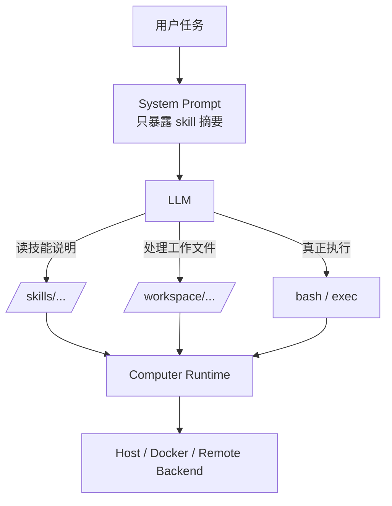
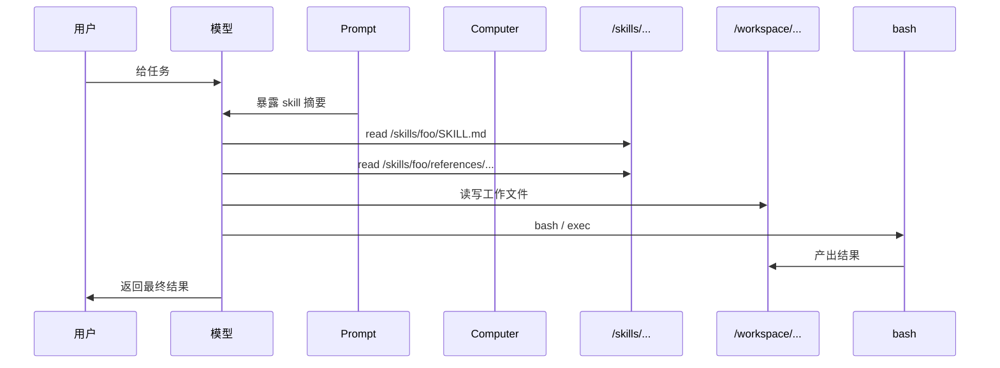
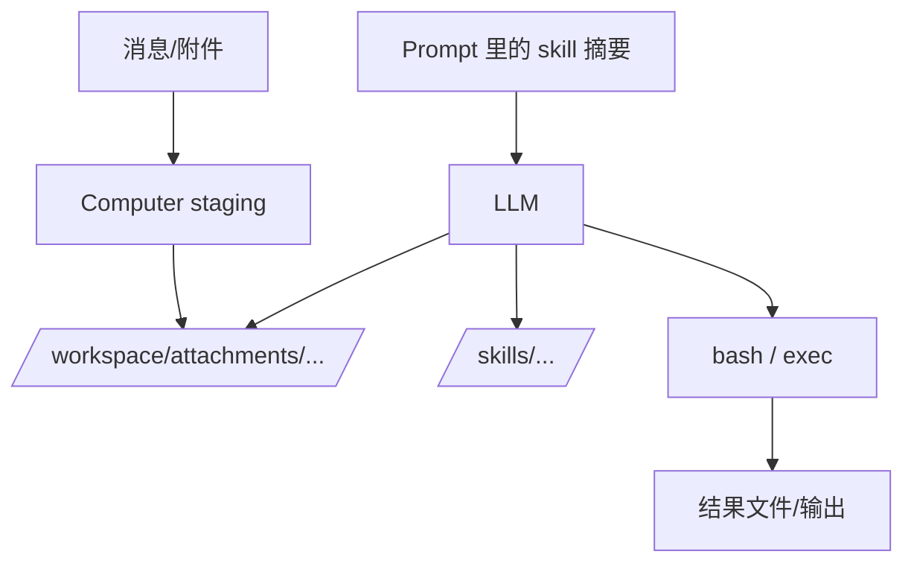

# computer 最终形态草图

这篇文档只讲**最终形态**。

不讲现状，不讲兼容，不讲过渡。

目标只有一个：

> 说清楚我理解的 `computer` 最终应该长什么样，尤其是在 **方案 A** 已经确定之后，skill、file system、bash、workspace 应该怎么一起工作。

---

## 一句话版本

最终的 `computer` 应该是：

- 一个统一的执行环境
- 给模型暴露两类稳定路径：
  - `/workspace/...`
  - `/skills/...`
- 给模型暴露少而强的通用能力：
  - `read`
  - `write`
  - `edit`
  - `ls`
  - `grep`
  - `exec`
  - `bash_*`
- skill 不再有专用运行时入口
- skill 就是模型可见的能力包文件树
- 真正干活主要靠：
  - 文件系统
  - bash
  - yolo

也就是说：

> **computer 不是一个“安全限制盒子”，而是一个让 LLM 真正能工作的 agent 环境。**

---

## 1. 顶层结构图



这张图的意思很简单：

- prompt 只负责告诉模型有哪些 skill
- skill 的正文不进 prompt
- 模型自己去 `/skills/...` 读
- 线程自己的工作内容在 `/workspace/...`
- 真正执行任务主要靠 bash
- `computer` 是统一基础设施，不是 skill 私有运行时

---

## 2. 模型看到的世界应该是什么样

最终我认为模型看到的世界应该非常简单。

### 只需要两类正式路径

#### 1. `/workspace/...`

这是当前线程的工作区。

里面放：

- 附件
- scratch 文件
- 临时结果
- 模型自己生成和修改的文件
- 一切 thread-local 产物

#### 2. `/skills/...`

这是当前 agent 可见的 skill 能力包目录。

里面放：

- `SKILL.md`
- `references/`
- `scripts/`
- `assets/`

重点是：

- 模型看到的是逻辑路径
- 不是宿主机真实路径
- backend 切换后，这套路径语义不变

所以对模型来说，世界应该像这样：

```text
/workspace/...
/skills/<skill_name>/SKILL.md
/skills/<skill_name>/references/...
/skills/<skill_name>/scripts/...
/skills/<skill_name>/assets/...
```

不要再让模型记：

```text
/home/acacia/...
/tmp/...
~/.acabot/...
```

那是实现细节，不该出现在模型世界里。

---

## 3. skill 在最终形态里到底是什么

在最终形态里，skill 不是：

- tool
- subagent
- 路由规则
- 审计对象
- 特权入口

skill 就是：

> **一组给 LLM 用的能力包文件。**

它更像：

- 操作手册
- 工作流说明
- 参考资料包
- 脚本和资源集合

所以 skill 的使用方式应该非常自然：


这才是方案 A 的真正味道。

不是：

- 先调用 skill 专用工具
- 再进入 skill 专用 runtime
- 再走 skill 专用审计链

那种形态不自然，也不够 agent。

---

## 4. bash 在最终形态里的位置

bash 不是辅助能力。

bash 是主能力面。

在我理解的最终形态里：

- skill 负责告诉模型“怎么做”
- 文件系统负责给模型“看见材料”
- bash 负责让模型“真的做完”

也就是说：

### skill 负责：

- 给方法
- 给流程
- 给脚本位置
- 给参考资料

### bash 负责：

- 跑命令
- 改文件
- 调脚本
- 组装结果
- 完成真实工作

所以最终形态不是“skill-first”，也不是“tool-first”。

而是：

> **skill 给上下文，bash 完成执行。**

> yolo + bash 才是最 agentic 的 bot

---

## 5. computer 在最终形态里到底负责什么

最终形态下，`computer` 应该只做基础设施，不做行为管教。

### computer 应该负责的事

#### 1. 提供统一的可见路径语义

- `/workspace/...`
- `/skills/...`

#### 2. 维护 thread workspace

- 附件落地
- scratch
- 文件读写
- shell session

#### 3. 把 skill materialize 成模型可见文件树

也就是：

- skill 在逻辑上出现在 `/skills/...`
- 但底层可以按 thread 做 materialize / mirror

#### 4. 提供稳定 backend 抽象

- host
- docker
- remote

但这些只是实现后端，不该改变模型看到的路径语义。

### computer 不应该负责的事

#### 1. 不要把自己做成 LLM 限制系统

不要总想着：

- 怎么禁止这个
- 怎么拦截那个
- 怎么加更多审批和规则

这种设计会很快把 agent 的能力面做残。

#### 2. 不要为了审计加太多 runtime 概念

底层有必要的记录就够了。

不要让 computer 背上“产品化审计平台”的任务。

#### 3. 不要替 skill 发明专用控制面

skill 就是文件树。

computer 负责把它稳定暴露出来，不要再发明 skill 私有协议。

---

## 6. 最终的数据流应该是什么样

### 6.1 skill 使用流



这条流里最关键的是：

- skill 不承担执行
- bash 不承担发现
- prompt 不承担正文
- computer 只提供环境

这四层不要混。

### 6.2 附件与 skill 一起工作的流



也就是说：

- 外部输入先进 `/workspace`
- 方法和说明来自 `/skills`
- 真正执行靠 bash

---

## 7. 我理解的最终目录语义

### 模型看到的目录

```text
/workspace/
  attachments/
  scratch/
  outputs/
  ...

/skills/
  foo/
    SKILL.md
    references/
    scripts/
    assets/
  bar/
    SKILL.md
    references/
    scripts/
    assets/
```

### 模型对这两棵树的感觉应该不同

#### 对 `/workspace`

感觉应该是：

- 我可以工作
- 我可以修改
- 我可以生成结果
- 我可以在 bash 里围绕它工作

#### 对 `/skills`

感觉应该是：

- 我可以学习
- 我可以查说明
- 我可以读参考资料
- 我可以找到脚本和资源
- 但这不是我的主工作区

这两种感觉一定要分开。

---

## 8. 我理解的最终工具面

最终工具面应该少而强。

### 通用文件工具

- `read`
- `write`
- `edit`
- `ls`
- `grep`

### 执行工具

- `exec`
- `bash_open`
- `bash_write`
- `bash_read`
- `bash_close`

### 不需要的东西

- skill 专用读取工具作为主路径
- 一 skill 一 tool
- skill 专用 helper 铺满系统

这不是说它们一律不能存在，而是：

> **它们不该定义最终形态。**

最终形态应该由：

- 文件系统
- computer
- bash

来定义。

---

## 9. 我理解的实现优先级

如果我自己来做最终形态，我会这么排。

### 第一优先级

把 `/skills/...` 做成正式可见根，并让：

- `read`
- `ls`
- `grep`

稳定工作。

### 第二优先级

把 skill materialize/mirror 的触发条件改成：

- 按路径访问触发

而不是：

- 先调 skill 专用入口再副作用 mirror

### 第三优先级

让 prompt 里明确告诉模型：

- 看到 skill 摘要后，先去读 `/skills/<name>/SKILL.md`

### 第四优先级

继续强化 bash 工作流，让模型可以更自然地：

- 先读 skill
- 再围绕 `/workspace` 工作
- 最后用 bash 完成任务

### 低优先级

- 复杂审计
- skill 专用控制面
- 花很多精力在限制层上

这些不是我理解里的主线。

---

## 10. 一句话总结

我理解的最终形态是：

> **computer 提供一个真正可工作的 agent 环境；模型通过 `/skills/...` 学会怎么做，通过 `/workspace/...` 处理工作对象，通过 bash 真正把事做完。**

再压缩一点就是：

> **方案 A + file system + computer + bash + yolo。**
